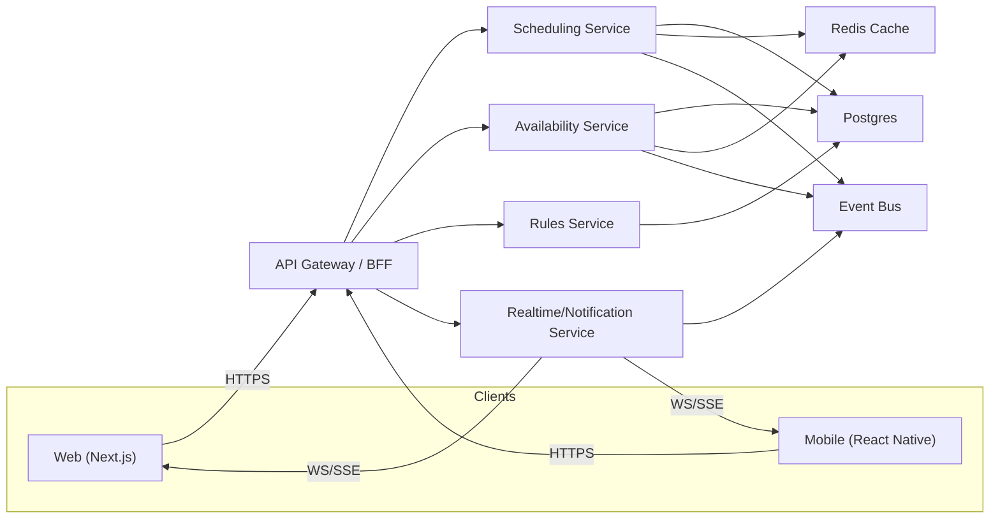
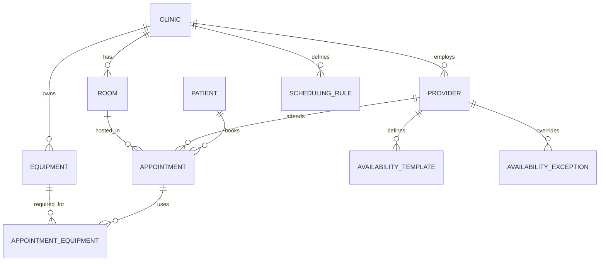

# Multi-Clinic Appointment Scheduling System — System Design

> **Scope:** Design a multi-tenant scheduling platform for ~500 clinics handling ~50,000 appointments/day with real-time availability, strict no-double-booking guarantees, and web/mobile clients.

---

## 1. System Overview

### Goals and constraints
The system must:

- Support **500 clinics**
- Handle **~50,000 appointments/day**
- Provide **real-time availability updates** (new bookings, cancellations, reschedules, provider/room/equipment changes)
- Work across **web + mobile**
- Enforce constraints:
  - provider availability + preferences
  - room booking
  - equipment constraints
  - buffer times (before/after)
  - appointment-type-specific rules
- Guarantee **no double-booking** for provider/room/equipment (correctness first)

### Key terminology
- **Provider**: the clinician whose calendar is being booked (doctor, NP, PA, therapist, dentist). Primary constraint.
- **Room**: physical space required for in-person visits.
- **Equipment**: shared resources needed for certain appointment types (e.g., ultrasound).
- **Availability**: feasible times where all required resources can be reserved.

### High-level architecture
- **Clients**: Web (Next.js/React) + Mobile (React Native)
- **API Layer**: API Gateway or BFF
- **Core services**:
  - Scheduling Service (create/reschedule/cancel)
  - Availability Service (slot computation + caching)
  - Rules Service (buffers, eligibility, min notice)
  - Realtime/Notification Service (WebSocket/SSE + email/SMS)
- **Storage**: Postgres (source of truth), Redis (availability cache, rate limiting)
- **Async/Eventing**: Kafka or SNS/SQS for invalidation + notifications

### Architecture diagram

### Technology choices (and why)

**Backend**
- **PostgreSQL**: transactional correctness, relational modeling, strong indexing for time-window queries, and constraint support.
- **Redis**: caching computed availability, rate limiting, and optional lightweight distributed locking primitives.
- **Event bus (Kafka / SNS+SQS / RabbitMQ)**: decouple scheduling writes from notifications and cache invalidation.

**Frontend**
- Web: **Next.js** (SSR, routing, performance patterns)
- Mobile: **React Native**
- Data layer: **TanStack Query** (server-state caching, retries, request de-duplication)

**Realtime**
- **WebSocket** for interactive scheduling UIs
- **SSE** fallback if WS is blocked or not needed

---

## 2. Data Model

### Core entities
Minimum set to support constraints:

- Clinic
- Provider
- Room
- Equipment
- Patient
- Appointment
- AppointmentEquipment (join table)
- AvailabilityTemplate (recurring provider hours)
- AvailabilityException (time off / clinic closure)
- SchedulingRule (buffers, min notice, limits)

### Entity relationships (conceptual)

### Storage choice
Use **PostgreSQL** as the source of truth:
- Strong consistency for bookings (transactions)
- Efficient time-window queries with correct indexes
- Constraints to prevent overlap/double-booking

Use **Redis** for:
- availability caching (read performance)
- rate limiting
- lightweight locks if needed (never the only correctness mechanism)

### Suggested tables (simplified)

**clinics**
- `id` (pk)
- `name`
- `timezone` (IANA string, e.g., `America/New_York`)
- `status`

**providers**
- `id` (pk)
- `clinic_id` (fk)
- `name`
- `specialty`
- `timezone_override` (nullable)
- `active`

**rooms**
- `id` (pk)
- `clinic_id` (fk)
- `name`
- `capacity` (for group visits, optional)
- `active`

**equipment**
- `id` (pk)
- `clinic_id` (fk)
- `name`
- `active`

**patients**
- `id` (pk)
- `clinic_id` (fk, or tenant mapping)
- `name`, `dob`, `mrn` (as needed)

**appointments**
- `id` (pk)
- `clinic_id` (fk)
- `patient_id` (fk)
- `provider_id` (fk)
- `room_id` (fk, nullable if telehealth)
- `start_ts_utc` (`timestamptz`)
- `end_ts_utc` (`timestamptz`)
- `type` (`in_person` / `telehealth` / `phone`)
- `status` (`scheduled` / `cancelled` / `completed` / `no_show`)
- `created_at`, `updated_at`
- `version` (int, optimistic concurrency)

**appointment_equipment**
- `appointment_id` (fk)
- `equipment_id` (fk)
- PK: (`appointment_id`, `equipment_id`)

**availability_templates**
- `id` (pk)
- `provider_id` (fk)
- `day_of_week` (0–6)
- `start_local_time` (time)
- `end_local_time` (time)
- `effective_from` (date)
- `effective_to` (date, nullable)

**availability_exceptions**
- `id` (pk)
- `provider_id` (fk)
- `start_ts_utc` (timestamptz)
- `end_ts_utc` (timestamptz)
- `reason`

**scheduling_rules**
- `id` (pk)
- `clinic_id` (fk)
- `appointment_type`
- `buffer_before_minutes`
- `buffer_after_minutes`
- `min_notice_minutes`
- `max_future_days`
- `allowed_rooms` / `required_equipment` (optional; can be separate tables)

### Indexing strategy
Common queries:
1) Availability for provider in a date range
2) Appointments for provider/room in a window
3) Conflict checks on booking

Recommended indexes:
- `appointments (clinic_id, start_ts_utc)`
- `appointments (provider_id, start_ts_utc)`
- `appointments (room_id, start_ts_utc)`
- Partial index for active appointments:
  - `WHERE status IN ('scheduled', 'checked_in', 'in_progress')`

Optional (best overlap performance):
- Store `tsrange(start_ts_utc, end_ts_utc)` + GiST indexes for overlap queries.

---

## 3. Availability Engine

### Problem statement
Given:
- clinic/provider timezone
- provider schedules (templates) + exceptions
- existing appointments (provider, room, equipment)
- rules (buffers, min notice, appointment types)
Return:
- available time slots (e.g., 15-min increments) that satisfy all constraints

### Slot computation approach
Use **working windows minus blocked windows**:

- Working windows come from `availability_templates`
- Blocked windows come from:
  - `availability_exceptions`
  - existing appointments (expanded with buffers)
  - resource constraints (room/equipment)

#### Algorithm (per provider + date range)
1) Convert requested local date range to UTC boundaries using clinic/provider timezone.
2) Fetch base working windows from templates; convert to UTC ranges.
3) Fetch exceptions; subtract them from working windows.
4) Fetch existing appointments in range (provider + room + equipment as needed).
5) Expand appointment blocks by `buffer_before` and `buffer_after` (rule-dependent).
6) Subtract blocked ranges from working windows.
7) Discretize remaining windows into `slotDuration` (e.g., 15 minutes).
8) For each candidate slot ensure:
   - provider is free
   - if in-person: at least one eligible room is free
   - if equipment required: required equipment is free
9) Return slots with metadata (timezone, applied rules, `etag`/`version`).

### Caching strategy
Availability can be expensive to compute repeatedly; cache it, but never rely on cache for correctness.

- Redis key pattern:
  - `avail:{clinicId}:{providerId}:{date}:{appointmentType}:{duration}`
- Value:
  - `slots[]`, `generated_at`, `rule_hash`, `etag`
- TTL:
  - 30–120 seconds (bounded staleness)
- Event-driven invalidation:
  - on create/update/cancel publish `AppointmentChanged`
  - availability service invalidates affected `{providerId, date}` keys (and relevant room/equipment keys)

### Concurrency and correctness (no double-booking)
Correctness is enforced at the **database** layer.

Booking flow:
1) Client requests to book a selected slot.
2) Scheduling service runs a **DB transaction**:
   - validate clinic/provider/patient
   - evaluate rules (buffers, resource requirements)
   - conflict checks (provider/room/equipment)
   - insert appointment
3) Commit.
4) Publish event `AppointmentCreated` (and/or `AppointmentChanged`) for invalidation + realtime updates.

#### Conflict enforcement options

**Option A: Postgres exclusion constraints (preferred)**
Use range overlap constraints so overlap is prevented automatically.

- Provider overlap constraint (conceptual):
  - `EXCLUDE USING GIST (provider_id WITH =, tsrange(start_ts_utc, end_ts_utc) WITH &&) WHERE (status IN active_statuses)`
- Room overlap constraint (similar):
  - `EXCLUDE USING GIST (room_id WITH =, tsrange(...) WITH &&) ...`

Equipment overlap is easiest if modeled as an `equipment_bookings` table rather than only a join table.

**Option B: Transactional overlap checks**
- Query overlapping appointments within the transaction and lock relevant rows (or a provider/room “calendar row”).
- More code and more risk than exclusion constraints, but workable.

If a race occurs, return **409 Conflict** and the UI prompts the user to pick another slot.

### Time zones and DST handling
Principles:
- Store timestamps in **UTC** in DB (`timestamptz`).
- Store clinic timezone as an IANA string.
- Convert local working windows to UTC when computing availability.
- UI displays in user-selected timezone and labels clinic timezone.

DST is handled by the timezone library (Luxon / Temporal / java.time).

---

## 4. API Design

### REST endpoints (core)

#### Availability
`GET /v1/clinics/{clinicId}/availability`

Query:
- `providerId`
- `startDate` (YYYY-MM-DD in clinic/provider local time)
- `endDate` (YYYY-MM-DD in clinic/provider local time)
- `appointmentType`
- `durationMinutes`

Response:
- `timezone`
- `slots[]` (ISO timestamps)
- `etag` (or `version`)

#### Appointments
`POST /v1/clinics/{clinicId}/appointments`

Body:
- `patientId`
- `providerId`
- `roomId` (optional for telehealth)
- `equipmentIds` (optional)
- `startTs` (ISO)
- `endTs` (ISO)
- `type`

Errors:
- `409 Conflict` (slot taken / resource unavailable)
- `400 Bad Request` (rules invalid, duration mismatch, min notice violated)

Other:
- `PUT /v1/clinics/{clinicId}/appointments/{id}` (reschedule/update)
- `DELETE /v1/clinics/{clinicId}/appointments/{id}` (cancel)
- `GET /v1/clinics/{clinicId}/appointments?from&to&providerId&roomId&status`

#### Rules
- `GET /v1/clinics/{clinicId}/rules`
- `PUT /v1/clinics/{clinicId}/rules` (admin-only)

### Realtime updates (WS/SSE)
Use-case: multiple schedulers viewing the same clinic/provider calendars.

- WS endpoint: `GET /v1/realtime?clinicId=...`
- Events:
  - `appointment.created`
  - `appointment.updated`
  - `appointment.cancelled`
  - `availability.invalidated` (provider/day, room/day, equipment/day)

Client behavior:
- On invalidation event, refetch relevant availability keys.

### Rate limiting
Apply per-user + per-IP limits at the gateway.
- Reads: higher limits
- Writes: stricter limits (e.g., 60/min)

### Caching behavior
- Availability uses Redis cache with TTL + invalidation.
- Read APIs can support `ETag` / `If-None-Match` to reduce payload and re-render churn.

---

## 5. Frontend Architecture

### State management
- Server state: **TanStack Query**
  - caches availability + appointments
  - dedupes concurrent requests
  - retries transient failures
- Local UI state:
  - current view (day/week), selected provider, selected clinic
  - selected slot, modal state
  - encoded in URL params for shareable views (web)

Example:
- `/schedule?clinic=abc&view=week&provider=p123&date=2026-02-14`

### Optimistic UI for booking
1) User clicks a slot and confirms.
2) UI shows a “pending” appointment block immediately.
3) On success: replace with server response.
4) On 409: rollback pending block, show message, refetch availability.

### Offline strategy (pragmatic)
- Read-only offline support:
  - store last viewed schedule/availability in persistent cache
  - disable booking actions while offline
- Avoid “offline bookings” due to high correctness risk.

### Shared web/mobile code
- Shared TypeScript types for API contracts
- Shared API client wrapper (auth, retries, error mapping)
- Share logic/hooks over UI components unless using a unified design system

---

## 6. Scalability and Reliability

### Scaling approach
- Stateless services behind load balancers
- Always scope queries by `clinic_id` (multi-tenant isolation)
- Availability cache reduces repeated computation on hot paths

### Database scaling
Start:
- Single Postgres cluster (primary + read replica if needed)
- Connection pooling (PgBouncer)

Next steps if needed:
- Partition appointments by time (monthly) or by tenant (clinic-based hash partitions)
- Tenant sharding (clinicId → shard) if clinic count and volume grow far beyond target

### Failure modes and graceful degradation
- Redis down → compute availability from DB (slower but correct)
- Event bus delays → cache invalidation lags; mitigate with short TTL
- WebSocket down → client falls back to polling
- Notification provider down → bookings still succeed; notifications retried async

### Consistency model
- Booking writes: **strong consistency** (DB transaction + constraints)
- Availability reads: **bounded eventual consistency** (TTL + invalidation), but **writes remain correct** due to DB checks

---

## 7. Observability

### Logging
Structured JSON logs with:
- `request_id` / `trace_id`
- `clinic_id`
- `user_id`
- route + method
- latency
- error code (including conflict reasons)

### Metrics
- API latency (p50/p95/p99), per endpoint
- Error rates (4xx vs 5xx)
- Availability cache hit rate
- Availability compute time
- Conflict rate (409) per clinic/provider
- DB slow queries + lock waits
- WS connections + events/sec

### Alerting
Page on:
- sustained 5xx spikes
- booking endpoint p95 latency threshold breach
- DB saturation (connections, CPU, replication lag)

Ticket on:
- cache hit rate drops
- conflict rate increases sharply (capacity or UX issue)

### Tracing
OpenTelemetry traces: gateway → services → DB
Correlate “slot selected” → “booking attempted” → “conflict returned” patterns.

---

## Appendix A: Booking transaction (reference)

### `POST /appointments` (conceptual)
1) Begin transaction
2) Validate entities (clinic/provider/patient)
3) Resolve rule set (buffers, room/equipment requirements)
4) Insert appointment (DB enforces constraints)
5) Commit
6) Publish `AppointmentCreated` event

If constraints fail:
- Rollback
- Return `409 Conflict` with reason and recommended refresh

---

## Appendix B: Notes / Future Enhancements
- Dedicated `equipment_bookings` table with exclusion constraints for clean equipment conflict enforcement
- Incremental availability updates (patch affected ranges vs invalidating whole day)
- Admin UI for scheduling rules, audit logs, and policy versioning
- Multi-region deployment strategy if nationwide latency requires it
- Automated load tests around peak hours to validate p95 under contention
